# Newsly Application 📰✨

**Newsly** is an interactive news application built using the **BBC News dataset**. It combines clean **data preprocessing**, structured categorization, and a **smart Chatbot powered by Gemini API**. The app features a modern **UI/UX design**, fully integrated **Firebase backend**, and an engaging news experience for users.  

---

## Features 🌟
- **Data Preprocessing & Categorization**: BBC News dataset cleaned, structured, and categorized into Politics, Sports, Technology, Business, and Health.  
- **System Design Diagrams**: Clear architecture diagrams guiding the implementation.  
- **UI/UX Prototype**: Designed on Figma for intuitive and interactive user experience.  
- **Interactive Chatbot**: Ask questions and get news summaries via the integrated Gemini-powered chatbot.  
- **Firebase Integration**: Real-time updates and secure backend support.  

---

## Screenshots 📸  

Explore the UI and functionalities through the screenshots below:  

- **Screen 0**  
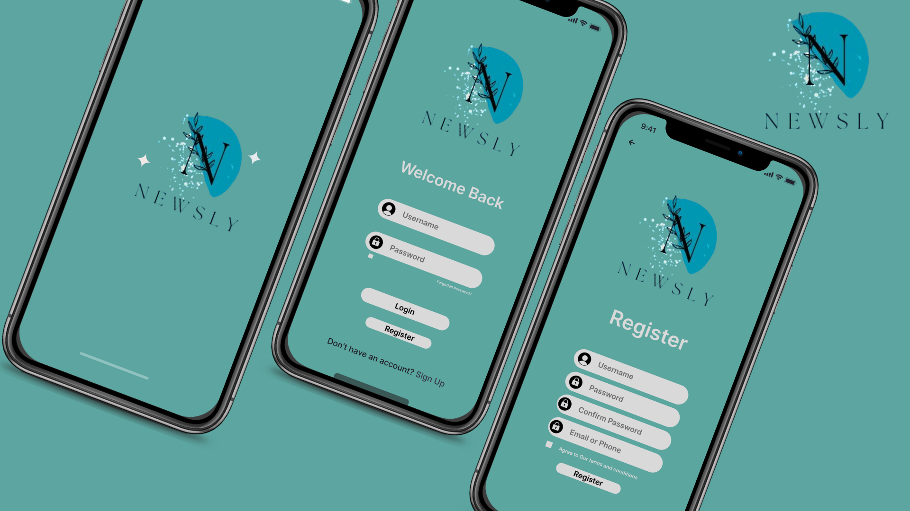  

- **Screen 1**  
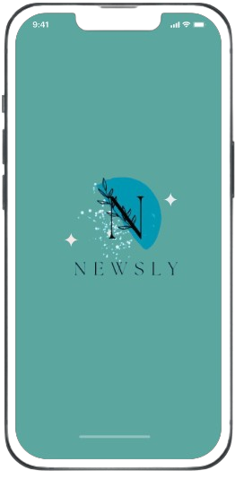  

- **Screen 2**  
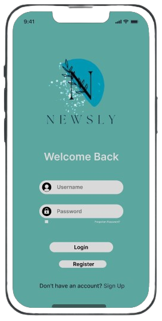  

- **Screen 3**  
  

- **Screen 4**  
  

- **Screen 5**  
  

- **Screen 6**  
  

- **Screen 7**  
  

- **Screen 8**  
  

- **Screen 9**  
  

- **Screen 10**  
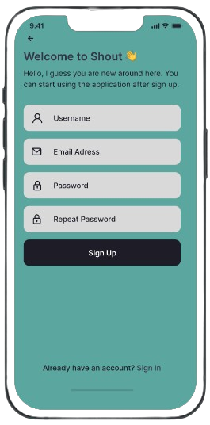  

- **Screen 11**  
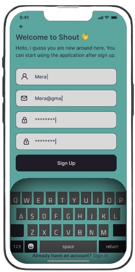  

- **Screen 12**  
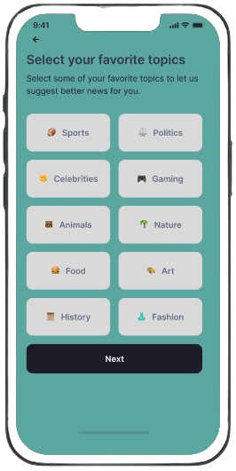  

- **Screen 13**  
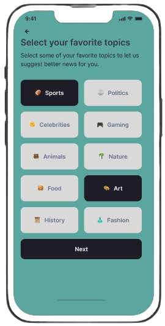  

- **Screen 14**  
  

- **Screen 15**  
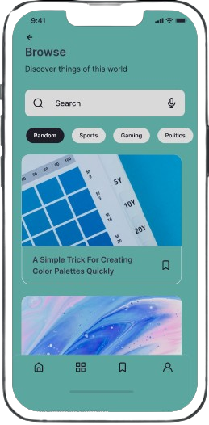  

- **Screen 16**  
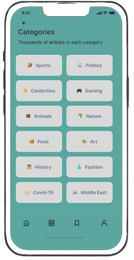  

- **Screen 17**  
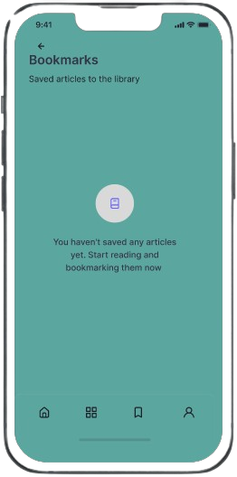  

- **Screen 18**  
  

- **Screen 19**  
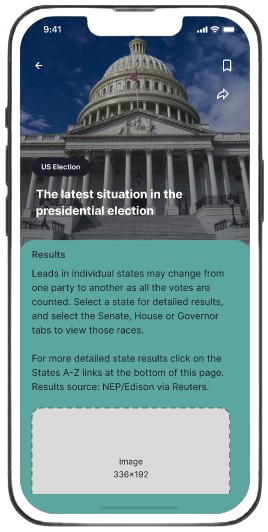  

- **Screen 20**  
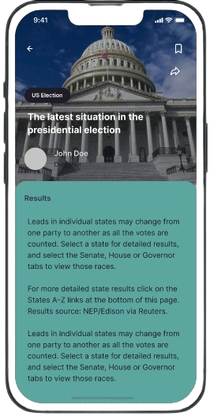  

- **Screen 21**  
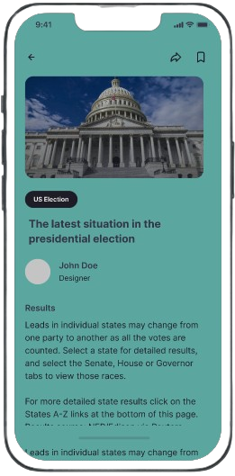  

- **Screen 22**  
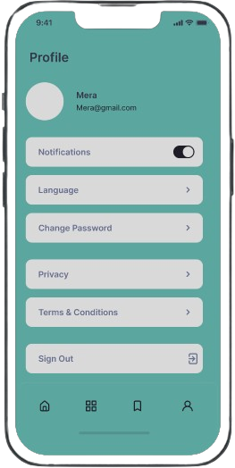  

- **Screen 23**  
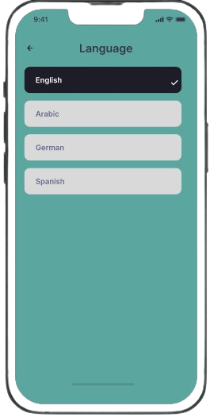  

---

## Installation 💻  

1. Clone the repository:  
```bash
git clone https://github.com/your-username/newsly-application.git
